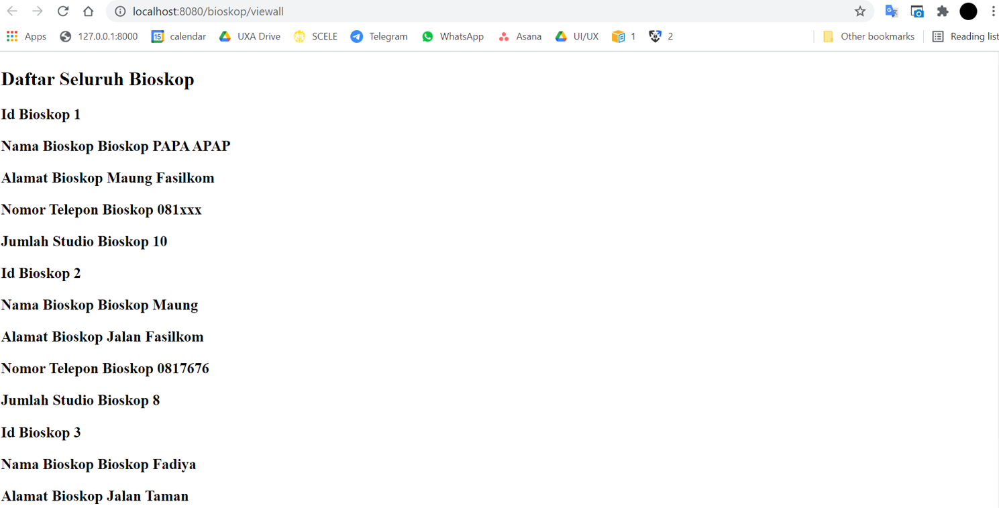

# Tutorial APAP
## Authors
* **Fadiya Latifah** - *1906399442* - *C*

## Tutorial 3
### What I have learned today
Pada hari ini, saya kembali mempelajari service, model, dan controller. Lalu saya belajar tentang cara menggunakan  Java Persistence API (JPA) untuk mengintegrasikan database server. Selain itu juga belajar package-package yang ada di lombok.
### Pertanyaan
1. Tolong jelaskan secara singkat apa kegunaan dari anotasi-anotasi yang ada pada model (@AllArgsConstructor, @NoArgsConstructor, @Setter, @Getter, @Entity, @Table) 

* @AllArgsConstructor = Merupakan salah satu interface bawaan package lombok yang berfungsi untuk menghasilkan/mengeluarkan constructor dengan 1 argumen untuk setiap field(bidang) di dalam class. Constructor yang dihasilkan secara default akan bertipe public dan tidak akan ke static field. Contoh fieldnya adalah @NonNull.
* @NoArgsConstructor = Merupakan salah satu interface bawaan package lombok yang berfungsi untuk men-generate constructor dengan 0 parameter (no parameter constructor). interface ini akan menghasilkan pesan error jika constructor tidak bisa dibuat akibat adanya final fields.
* @Setter = Merupakan salah satu syntax di lombok yang berguna agar lombok bisa menghasilkan method setter public secara otomatis untuk semua field di sebuah class. Jadi tidak perlu memasang setter secara manual seperti java pada umumnya.
* @Getter = Merupakan salah satu syntax di lombok yang berguna agar lombok bisa menghasilkan method getter public secara otomatis untuk semua field di sebuah class. Jadi tidak perlu memasang getter secara manual seperti java pada umumnya.
* @Entity = @Entity berguna untuk membuat suatu string yang dimasukkan setelahnya menjadi nama entity. Atau dalam kata lain merupakan class pada model untuk menujukkan bahwa ini adalah entitas/bisa juga nama tabel default. 
* @Table =  @Entity berguna untuk membuat suatu string yang dimasukkan setelahnya menjadi nama tabel di dalam database. @Table dapat digunakan untuk mengganti nama tabel jika ingin mengubah nama yang ada di default @Entity.

2. Pada class BioskopDB, terdapat method findByNoBioskop, apakah kegunaan dari method tersebut? 
Method findByNoBioskop adalah method yang berfungsi untuk mencari data bioskop berdasarkan nomor bioskop yang didapatkan dari parameter fungsi ini. Pada interface BioskopDB, method ini bersifat optional.

3. Jelaskan perbedaan kegunaan dari anotasi @JoinTable dan @JoinColumn 

@JoinTable pada JDA biasanya bisa digunakan untuk mendapat database yang lebih ternormalisasi dan tidak banyak redundansi data akibat penggabungan banyak entitas. @JoinTable merupakan default typenya. @JoinTable bisa digunakan untuk mengatur hubungan antara antitas dengan tabel lain sehingga ketika data diakses, tabel harus di gabung dulu untuk mendapat sebuah hubungan.

Sedangkan @JoinColumn biasa digunakan untuk menandai bahwa sebuah kolom itu merupakan kolom gabungan dari beberapa entitas/elemen. Biasa digunakan ketika entity punya hubungan langsung. @JoinColumn digunakan untuk meningkatkan performance karena bisa diguanakan tanpa harus menggabungkan tabel tambahan(langsung akses saja kolomnya).

4. Pada class PenjagaModel, digunakan anotasi @JoinColumn pada atribut bioskop, apa kegunaan dari name, referencedColumnName, dan nullable dalam anotasi tersebut? dan apa perbedaan nullable dan penggunaan anotasi @NotNull
* name = untuk menamai kolom baru yang merupakan gabungan lebih dari satu elemen/entitas, atau dalam kata lain sebagai nama kolom foreign key
* referencedColumnName = berisi nama kolom yang dijadikan referensi/rujukan oleh kolom name(foreign key)
* nullable: menandai apakah kolom foreign key boleh bernilai null atau tidak. 
* Perbedaan nullable dengan @NotNull = Kalau nullable merupakan element bertipe boolean untuk menandakan apakah kolom foreign key boleh bernilai null atau tidak. Sedangkan @NotNull itu menandakan bahwa nilainya tidak boleh null. jika nilainya kosong masih dilegalkan.

5. Jelaskan kegunaan FetchType.LAZY, CascadeType.ALL, dan FetchType.EAGER
* FetchType.LAZY = Merupakan salah satu strategi mengambil data dari database, dimana database diambil dengan lazy( inisialisasi objek ditunda selama mungkin) saat pertama kali diakses. Jadi data akan diinisialisasi dan dimuat ke dalam memori ketika ada panggilan eksplisit saja.
* CascadeType.ALL = Merupakan salah satu cara menyimpan entitas yang dipetakan setiap entitas owner disimpan. CascadeType.ALL digunakan bila kita ingin membuat rules bahwa semua action/perubahan yang terjadi antara owner dengan entitas lain, haruslah di cascade.
* FetchType.EAGER = Merupakan salah satu strategi mengambil data dari database, yang merupakan persyaratan pada runtime provider bahwa data harus diambil dengan eager(inisiasi data terjadi di tempat). Jadi ketika load suatu data, maka akan memanggil data lain yang terasosiasi juga lalu menyimpannya di memori

### What I did not understand

## Tutorial 2
### What I have learned today
1. Pertanyaan 1: Cobalah untuk menambahkan sebuah Bioskop dengan mengakses link berikut: http://localhost:8080/bioskop/add?idBioskop=1&namaBioskop=Bioskop%20PAPA%20 APAP&alamat=Maung%20Fasilkom&noTelepon=081xxx&jumlahStudio=10 Apa yang terjadi? Jelaskan mengapa hal tersebut dapat terjadi?

Pada saat saya menambahkan bioskop melalui link tersebut, terjadi error 500 dengan spesific error "Error resolving template[add-bioskop]". Hal ini terjadi karena pada saat itu, saya belum membuat template/halaman html add-bioskop. Sedangkan di controller saya sudah menginisiasi return "add-bioskop". Agar tidak error, kita harus membuat page htmlnya terlebih dahulu.

2. Pertanyaan 2: Menurut kamu anotasi @Autowired pada class Controller tersebut merupakan implementasi dari konsep apa? Dan jelaskan secara singkat cara kerja @Autowired tersebut dalam konteks service dan controller yang telah kamu buat!

Setelah saya membaca beberapa referensi dari internet dan digabungkan dengan pendapat saya, menurut saya @autowired merupakan implementasi dari konsep Dependency injection. Cara kerja autowired dalam service dan controller adalah, autowired membuat spring mungkin untuk menyelesaikan & menginjeksikan bean bioskopservice ke pihak yang mengimplemennya(bioskopinmemoryservice). Sehingga pada controller, otomatis memiliki semua objek dari yang mengimplementnya. jadi controller bisa langsung mendapat service tanpa harus mengimplementasi variabel/elemen/constructor dari bioskopservice.

3. Pertanyaan 3: Cobalah untuk menambahkan sebuah Bioskop dengan mengakses link berikut: http://localhost:8080/bioskop/add?idBioskop=1&namaBioskop=Bioskop%20PAPA%20 APAP&alamat=Maung%20Fasilkom&noTelepon=081xxx Apa yang terjadi? Jelaskan mengapa hal tersebut dapat terjadi.

Pada saat saya menambahkan bioskop melalui link tersebut, terjadi error 400 dengan spesifik error "required request parameter 'jumlah studio' for method parameter type is not present". Hal ini terjadi karena web di atas tidak lengkap, tidak memiliki parameter jumlahstudio. Sehingga agar tidak error, link nya harus ditambahkan jumlah studio setelah nomor teleponnya.

4. Pertanyaan 4: Jika Papa APAP ingin melihat Bioskop dengan nama Bioskop Maung, link apa yang harus diakses?

Untuk melihatnya, asumsikan saya telah membuat bioskop baru bernama Bioskop Maung dengan id 2 melalui akses link http://localhost:8080/bioskop/add?idBioskop=2&namaBioskop=Bioskop%20Maung&alamat=Jalan%20Fasilkom&noTelepon=0817676&jumlahStudio=8. Maka setelah itu, kita bisa melihatnya melalui link http://localhost:8080/bioskop/view?idBioskop=2.

5. Pertanyaan 5: Tambahkan 1 contoh Bioskop lainnya sesukamu. Lalu cobalah untuk mengakses http://localhost:8080/bioskop/viewall , apa yang akan ditampilkan? Sertakan juga bukti screenshotmu.

Setelah memiliki 2 bioskop sebelumnya, saya menambahkan lagi bioskop ber-id 3 melalui link http://localhost:8080/bioskop/add?idBioskop=3&namaBioskop=Bioskop%20Fadiya&alamat=Jalan%20Taman&noTelepon=0211906399442&jumlahStudio=5. Lalu setelah mengakses halaman viewall, maka akan terlihat semua biskop saya (saat itu ada 3 bioskop). Setelah menambahkan dan membuka page viewall, setiap bioskopnya akan terlihat valuenya/parameternya. Mulai dari id, nama bioskop, alamat, nomor telepon, dan jumlah studio. Tampilan ini akan sesuai dengan kode html yang ditulis di html viewall-bioskop.html. Berikut screenshootnya:

## Tutorial 1
### What I have learned today
### Github
1. Apa itu Issue Tracker? Apa saja masalah yang dapat diselesaikan dengan Issue Tracker?
    Issue tracker atau nama lainnya Issues adalah salah satu fitur tracking pada github yang terhubung ke github repository. Issues tracker memungkinkan kita untuk melacak pekerjaan/project yang sedang kita kembangkan. Issues bisa dikategorisasikan dengan labels dan milestones. Dengan menggunakan issue tracker, kita dapat melacak progres, enchancements, ataupun melakukan tracking bug dari project kita/tim kita. Issue tracker dapat mencegah error yang bisa saja terjadi ketika kita melakukan suatu project terdiri dari beberapa developer karena issue tracker berfokus pada kolaborasi. Kita bisa mengunggah progress kita untuk disebar, didiskusikan, atau dikomen oleh anggota tim yang lain sehingga memudahkan komunikasi dengan fitur-fitur yang ada di Issue. 

2. Apa perbedaan dari git merge dan git merge --squash?
    Git merge merupakan command git yang berguna untuk menggabungkan commit yang telah dipush sebelumnya ke repository github, namun dengan mempertahankan semua commit pada features branch yang telah ada sebelumnya, serta menyisipkannya dengan commit di master branch. Jadi setiap commit sebelumnya akan tetap ada dan digabungkan ke dalam sebuah commit di master branch untuk lines yang berubah.

    Sedangkan Git merge ---squash adalah opsi penggabungan di git yang akan menghasilkan commit gabungan dengan hanya satu parent. Yang membedakan dari git merge adalah pada git merge squash ini history dari banyak commit features branch sebelumnya akan hilang, lalu setelah berubahan itu diremas, akan dipindahkan kedalam suatu commit yang baru di master branch. 

3. Apa keunggulan menggunakan Version Control System seperti Git dalam pengembangan suatu aplikasi?
    Dalam pengembangkan aplikasi, version control system akan membantu developer dalam efisiensi hingga memudahkan kolaborasi/pengembangan. Pertama, Version control system memiliki keunggulan yaitu membantu melacak perubahan code yang ada. Developer bisa melihat apa saja yang berubah di setiap versi file sehingga bisa cepat melacak letak error jika terdapat error. Kita juga bisa mengembalikan suatu versi aplikasi jika tidak sengaja menghapus suatu file/code. Kita bisa kembali ke versi yang lebih lama jika di versi terbaru program kita ada error. Lalu version control system juga memiliki keunggulan yaitu memudahkan kolaborasi karena membuat kita bisa mengintegrasikan pekerjaan lebih dari satu developer tanpa mempengaruhi alur kerja satu sama lain. Kita juga bisa melacak jika ada conflict dalam proses kolaborasi dalam pengembangan aplikasi.

### Spring
4. Apa itu library & dependency?
    Library adalah bagian dari sebuah software yang dapat digunakan di program atau project lainnya. Library memiliki jenis yaitu library internal dan library eksternal seperti 3rd party. Library bersifat non-executable tapi membutuhkan consumer. Library berisi sekumpulan class dengan fungsi yang mirip, lalu dikelompokkan bersama sehingga mudah digunakan dalam project lain. Sedangkan dependency adalah hubungan atau relasi antara 2 hal, contohnya seperti antar code atau antar code yang menggunakan beberapa library. 

5. Apa itu Maven? Mengapa kita menggunakan Maven? Apakah ada alternatif dari Maven?
    Maven adalah adalah salah satu landasan dalam pengembangan Java, serta merupakan build management tool yang paling banyak digunakan untuk Java (Java build tools). Maven menggunakan konsep Object model yang berbasis XML File yang memungkinkan developer untuk memahami garis besar proyek Java yang akan dikembangkan dengan cepat. 
    
    Kita menggunakan maven karena memiliki banyak keunggulan jika kita ingin mengembangkan produk/aplikasi dengan Java. Maven dapat membuat struktur project sendiri sehingga project itu dapat dibuka dengan berbagai IDE. Lalu dependency bisa diatur dengan mudah karena biasanya development java membutuhkan banyak file jar diluar default file jar di JDK. Hanya tinggal definisikan saja di File POM.xml dependency-nya, maka file-file jar tersebut akan otomatis terdownload ke Repository. lalu maven juga mendukung pemeliharaan proyek jangka panjang dan memiliki pilihan plugins yang bervariasi.

    Terdapat beberapa alternatif untuk maven, diantaranya Gradle, Jira, Cmake, Apache Ant, dan Jenkins.

6. Selain untuk pengembangan web, apa saja yang bisa dikembangkan dengan Spring framework?
    Selain untuk pengembangan web, Spring freamework juga bisa membantu pembuatan/pengembangan aplikasi enterprise, aplikasi yang terkait dengan big data, aplikasi processing, transaction, data access, hingga security.

7. Apa perbedaan dari @RequestParam dan @PathVariable? Kapan sebaiknya menggunakan @RequestParam atau @PathVariable?
    @PathVariable adalah untuk mengekstrak data atau beberapa placeholder langsung dari URI dan mengambil nilai dari URI itu sendiri, sedangkan @RequestParam digunakan untuk mengekstrak query parameters.

    @PathVariable sebaiknya digunakan untuk RESTful web services, sedangkan @RequestParam lebih cocok untuk digunakan pada traditional website.

### What I did not understand
(tuliskan apa saja yang kurang Anda mengerti, Anda dapat men-_check_ apabila Anda
sudah mengerti dikemudian hari, dan tambahkan tulisan yang membuat Anda mengerti)
- [ ] Flow serta keterkaitan antara file-file yang otomatis terbentuk saat membuat project springboot
